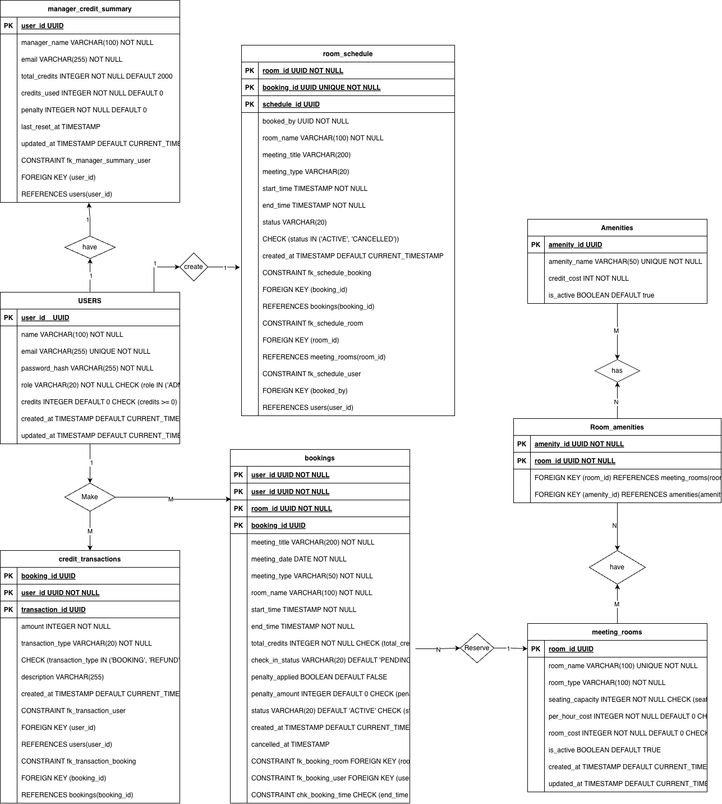

# BOOKIT DB

BOOKIT Database is the relational database designed for an **Automated Meeting Room Booking System**.  
It supports role-based access, credit-based bookings, room scheduling, and amenity-based cost calculations.

## Key Entities

- **Users** – Admins, Managers, and Members
- **Meeting Rooms** – Room configuration and capacity
- **Amenities** – Credit-based add-ons
- **Bookings** – Room reservations
- **Room Schedule** – Real-time availability
- **Manager Credit Summary** – Credit usage tracking

##  Entity Relationship Overview

- One **User** → Many **Bookings**
- One **Room** → Many **Bookings**
- One **Booking** → One **Room Schedule**
- Many **Rooms** ↔ Many **Amenities**
- Credits are consumed only by **Managers**

### ER Diagram

##  USERS TABLE

### Purpose
Stores system users with credentials, roles, and credits.

### Structure

| Column        | Type          | Description |
|--------------|--------------|------------|
| user_id      | UUID         | Primary Key |
| name         | VARCHAR(100) | User full name |
| email        | VARCHAR(255) | Unique email |
| password_hash| VARCHAR(255) | Encrypted password |
| role         | VARCHAR(20)  | ADMIN / MANAGER / MEMBER |
| credits      | INTEGER      | Available credits |
| created_at  | TIMESTAMP    | Created time |
| updated_at  | TIMESTAMP    | Updated time |

### Notes
- Managers start with **2000 credits**
- Members cannot book rooms
- Admins manage rooms and amenities

---

##  MEETING_ROOMS TABLE

### Purpose
Stores meeting room configuration and cost parameters.

### Structure

| Column           | Type         | Description |
|------------------|-------------|------------|
| room_id          | UUID        | Primary Key |
| room_name        | VARCHAR(100)| Unique room name |
| room_type        | VARCHAR(100)| Room category |
| seating_capacity | INTEGER     | Total seats |
| per_hour_cost    | INTEGER     | Base hourly cost |
| room_cost        | INTEGER     | Final computed cost |
| is_active        | BOOLEAN     | Availability |
| created_at       | TIMESTAMP   | Created time |
| updated_at       | TIMESTAMP   | Updated time |

---

##  AMENITIES TABLE

### Purpose
Lists all amenities with their credit costs.

### Structure

| Column       | Type        | Description |
|-------------|------------|------------|
| amenity_id  | UUID       | Primary Key |
| amenity_name| VARCHAR(50)| Unique amenity |
| credit_cost | INTEGER    | Cost per hour |
| is_active   | BOOLEAN    | Availability |

### Example Data

| Amenity | Credits |
|-------|---------|
| PROJECTOR | 5 |
| WIFI | 10 |
| CONFERENCE_CALL | 15 |
| WHITEBOARD | 5 |
| TV | 10 |

---

##  ROOM_AMENITIES TABLE

### Purpose
Defines many-to-many relationship between rooms and amenities.

### Structure

| Column   | Type | Description |
|--------|------|------------|
| room_id | UUID | FK → meeting_rooms |
| amenity_id | UUID | FK → amenities |

### Notes
- Cascade delete enabled
- Allows flexible amenity configuration

---

##  BOOKINGS TABLE

### Purpose
Manages meeting reservations, credits, and penalties.

### Structure

| Column            | Type         | Description |
|------------------|-------------|------------|
| booking_id       | UUID        | Primary Key |
| room_id          | UUID        | FK → meeting_rooms |
| user_id          | UUID        | FK → users |
| meeting_title    | VARCHAR(200)| Meeting title |
| meeting_date     | DATE        | Meeting date |
| meeting_type     | VARCHAR(50) | Internal / External |
| start_time       | TIMESTAMP   | Start time |
| end_time         | TIMESTAMP   | End time |
| total_credits    | INTEGER     | Credits consumed |
| check_in_status  | VARCHAR(20) | PENDING / CHECKED_IN / NO_SHOW |
| penalty_applied  | BOOLEAN     | Penalty flag |
| penalty_amount   | INTEGER     | Penalty credits |
| status           | VARCHAR(20) | ACTIVE / CANCELLED |
| created_at       | TIMESTAMP   | Created time |
| cancelled_at     | TIMESTAMP   | Cancelled time |

### Constraints
- `end_time > start_time`
- Credits cannot be negative
- No overlapping schedules

---

##  ROOM_SCHEDULE TABLE

### Purpose
Tracks real-time room occupancy.

### Structure

| Column        | Type        | Description |
|--------------|------------|------------|
| schedule_id  | UUID       | Primary Key |
| booking_id   | UUID       | Unique FK |
| room_id      | UUID       | FK → meeting_rooms |
| booked_by    | UUID       | FK → users |
| room_name    | VARCHAR(100)| Room name |
| meeting_title| VARCHAR(200)| Meeting title |
| start_time   | TIMESTAMP  | Start time |
| end_time     | TIMESTAMP  | End time |
| status       | VARCHAR(20)| ACTIVE / CANCELLED |
| created_at   | TIMESTAMP  | Created time |

---

##  MANAGER_CREDIT_SUMMARY TABLE

### Purpose
Tracks manager credit usage and penalties.

### Structure

| Column        | Type        | Description |
|--------------|------------|------------|
| user_id      | UUID       | Primary Key |
| manager_name | VARCHAR(100)| Manager name |
| email        | VARCHAR(255)| Email |
| total_credits| INTEGER    | Default 2000 |
| credits_used | INTEGER    | Used credits |
| penalty      | INTEGER    | Penalty credits |
| last_reset_at| TIMESTAMP  | Last reset |
| updated_at   | TIMESTAMP  | Updated time |

---

##  SEATING_CAPACITY_CREDITS TABLE

### Purpose
Defines credit cost based on seating capacity.

| Min Seats | Max Seats | Credit Cost |
|----------|-----------|-------------|
| 0 | 5 | 0 |
| 6 | 10 | 10 |
| 11 | 1000 | 20 |

---

## 🔄 Data Flow