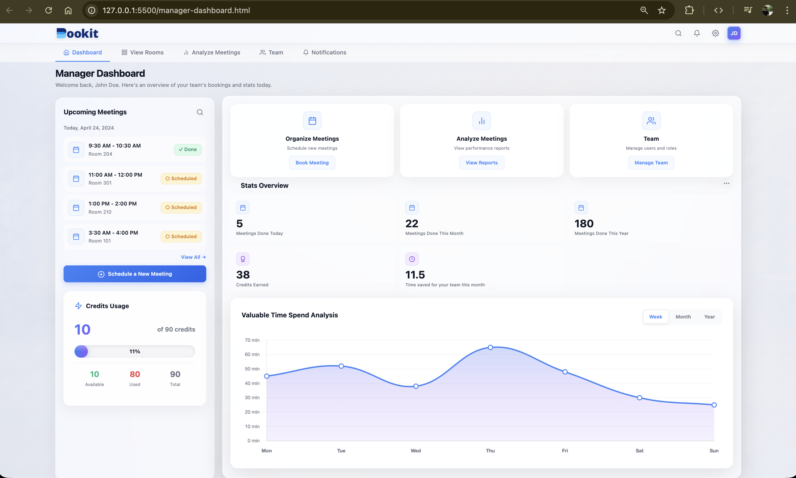

# Bookit

## Overview

The **Automated Meeting Room Booking System**, developed by **Team 404 Not Found**, is a centralized enterprise-grade platform designed to optimize office meeting room utilization. It introduces a **credit-based booking economy** combined with **Role-Based Access Control (RBAC)** to ensure fair usage, eliminate scheduling conflicts, and enforce accountability through an automated and professional workflow.

## Features

- **Admin Module**:  
  - Create and configure meeting rooms.
  - Manage amenities.
  
- **Manager Module**:  
  - Book available meeting rooms based on real-time availability.
  - Customize room settings by selecting from available amenities (WiFi, TV, water dispenser, whiteboard, etc.).
  - Configure room capacity and time slots.
  - Manage weekly credits (2000 points) allocated every Monday, with credits deducted based on selected amenities and room configurations.

- **Member Module**:  
  - View scheduled meetings, including details on time, room, and selected amenities.
  
## Technology Stack

- **Frontend**: HTML, CSS, JavaScript (Implemented with dummy data for demonstration)
- **Backend**: Java&springboot, PostgreSQL (For database management and backend logic)
  
## Documentation

**BOOKIT** provides a seamless interface and backend support to handle all aspects of meeting room management:

- **Efficient Room Booking**: Enables managers to book rooms quickly based on current availability.
- **Amenities Booking**: Allows pre-selection of room amenities to ensure all necessary equipment and resources are available during meetings.
- **Credit Management**: Ensures that managers stay within their allocated budget through an intuitive credit system, promoting efficient use of resources.
  
## Screenshots
1. Login Page:

2. Highlights Page:

3. Admin Page:
   

4. Manager Dashboard Page:
   

5. Create Room Page:
   

6. Notification:
    

## Credits

- **Developed by**: Rishita, Ankit, Aman , Pulkit
- **Design**: Rishita, Aman
- **Testing**: Ankit, Pulkit

## License

© 2025 Bookit.
