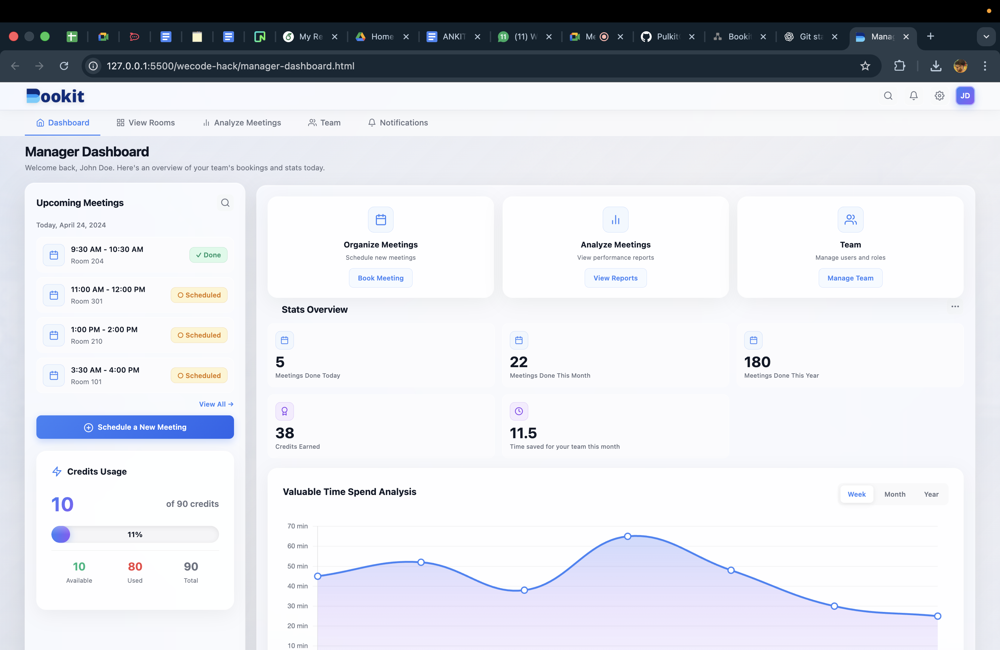
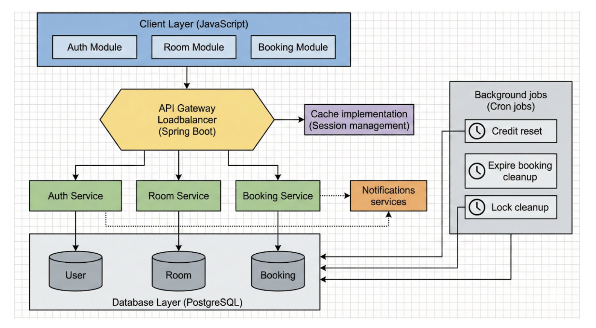
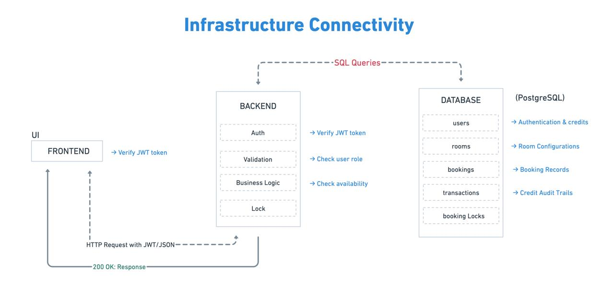

# 

**Team Name: 404 Not Found**

## Proposed Solution
The **Automated Meeting Room Booking System**, developed by **Team 404 Not Found**, is a centralized enterprise-grade platform designed to optimize office meeting room utilization. It introduces a **credit-based booking economy** combined with **Role-Based Access Control (RBAC)** to ensure fair usage, eliminate scheduling conflicts, and enforce accountability through an automated and professional workflow.

## 🎯 Problem Statement & Scope

### Current Challenges
- **Manual Overhead:** Manual scheduling results in double bookings and operational inefficiencies.
- **Resource Inefficiency:** Premium meeting rooms are frequently misused for small meetings without cost accountability.
- **Lack of Access Control:** No clear separation between administrative configuration, booking authority, and general visibility.

### Proposed Scope
The system delivers an end-to-end digital solution to:
- Search and book meeting rooms based on seating capacity and amenities.
- Prevent double bookings and handle concurrent access safely
- Enforce fair usage through a credit-based system
- Provide clear role-based access and responsibilities
- Ensure configurability of rooms, amenities, and pricing
- Offer visibility into schedules and booking history

## User Roles & Authorization Model

The system enforces a **Layered Authorization (RBAC)** model.

| Role    | Key Permissions |
|-------- |----------------|
| `Admin`   | `Create, configure, and edit meeting rooms; manage amenities and pricing` |
| `Manager` | `Search rooms, book meetings, and spend allocated credits , manage team`|
| `Member` | `View-only access to room schedules and booking status` |

## Credits Allotment
- **Manager Wallet:** 2000 credits allocated by default.
- **Automated Reset:** All manager wallets reset to 2000 credits every **Monday at 6:00 AM** via Cron Job.
- **Restrictions:** Admins and Members have 0 credits and cannot initiate bookings.

## Data Flow Diagram

##  System workflow 

### Technology Stack
- **Frontend:** HTML, CSS, JavaScript (Component-based UI)
- **Backend:** Java with Spring Boot (Microservices-ready architecture)
- **Database:** PostgreSQL (Cloud-hosted)

## UI/UX Workflow

### Pages & Dashboards
- **Home Page:** Login and navigation hub.
- **Admin Dashboard:**  
  - Create Room  
  - Edit Room  
  - Manage amenities and credit cost mappings
- **Manager Portal:**
  - View all rooms 
  - Advanced Search & Filter
  - Book Rooms with real-time credit deduction
  - View room analytics & ussage
  - View Team
  - Manage Notifications 
- **Member View:**  
  - Read-only calendar/grid view of current and upcoming bookings

##  **System Interactions**

## Implementation Strategy & Team Distribution

### Sub-Team A: UI/UX  
**Members:** Amanpreet, Rishita  
- Designing responsive layouts using CSS frameworks  
- Creating dummy-data UI prototypes for early validation  
- Maintaining technical documentation  

### Sub-Team B: Backend & Database  
**Members:** Ankit, Pulkit  
- Developing RESTful APIs and business logic  
- Implementing database locking to avoid race conditions  
- Scheduling the weekly credit reset Cron Job  
- Ensuring reliable testing using JUnit  

### Work Contributions

#### Development Pipeline

- **UI/UX:**  
  UI design and UI code implementation.

- **Connectivity Testing:**  
  - UI → Backend connectivity testing  
  - Backend → Database connectivity testing

- **Full Stack Integration:**  
  UI (API) → Backend (Endpoints) → Cloud Database

- **Logic & Security:**  
  - Authentication & Authorization  
  - Transaction management to prevent race conditions

- **Finalization:**  
  Comprehensive project documentation.

## Team Members

| Name        | Mandatory Amenities              |
|-------------------- |---------------------------------|
| Rishita Naniwal  | UI Desigining, Frontend, Documentation           |
| Aman Preet Singh     | UI Desigining, Frontend, Documentation                 |
| Ankit Bhandari     | Backend API & Database        |
| Pulkit    | Backend API & Database                       |

## Project Documentation
*Recommended
👉 **[Click here to view the complete project documentation](https://docs.google.com/document/d/15EL4luxd8VmWfRGuHchPDdozEf4jHgQToxO-ctwLBG4/edit?tab=t.7u45fnw8850e#heading=h.gd8q705vbsli)**

## Demo Video

https://github.com/user-attachments/assets/2e97482a-348b-4381-9cab-d4186b0a6f0e
**Pushed to perfection by *Team 404 Not Found* 💪🏻🛠**
